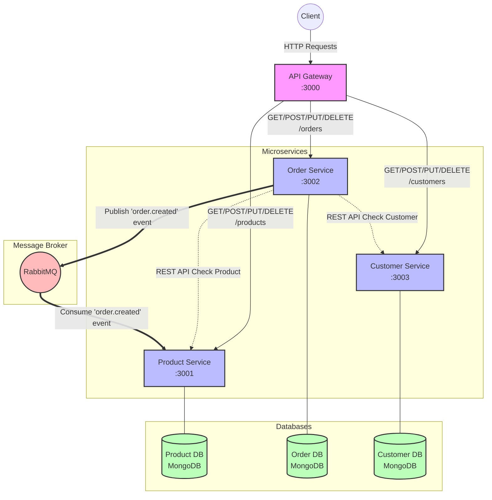

# System Architecture

Here is the diagram illustrating the communication between the services in the Sales Management System.

## Description
1. **API Gateway**: Acts as the single entry point. It proxies incoming requests to the appropriate Microservice.
2. **Synchronous Communication**: The `Order Service` uses REST APIs to communicate synchronously with the `Product Service` and `Customer Service` to validate whether a product and a customer exist before creating an order.
3. **Asynchronous Communication**: When an order is successfully created, the `Order Service` publishes an event (`order.created`) to the Message Broker (`RabbitMQ`). The `Product Service` consumes this event to asynchronously reduce the product inventory.
4. **Database per Service**: Each microservice maintains its own MongoDB database, satisfying the "Database per Service" pattern.
